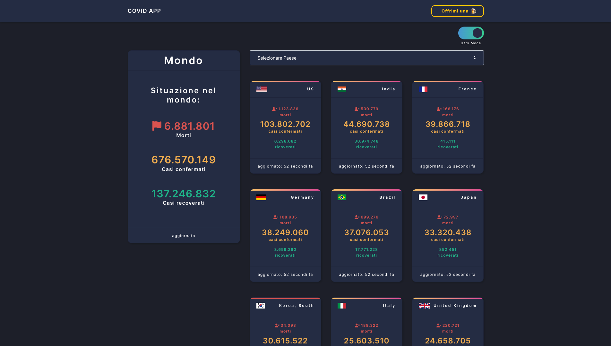

# COVID-19 Web App

[](https://github.com/webdazer0/covid-italia/actions/workflows/firebase-hosting-merge.yml)

**Production app:**

- https://covid-italia.web.app/



## Development Setup

### Prerequisites

- Install [Node.js] 16 which includes [Node Package Manager][npm]

### Setting Up a Project

Run the application:

```
npm install
npm start
```

Runs the app in the development mode.<br />
Open [http://localhost:3000](http://localhost:3000) to view it in the browser.

### Release

```
npm run build
```

[node.js]: https://nodejs.org/
[npm]: https://www.npmjs.com/get-npm